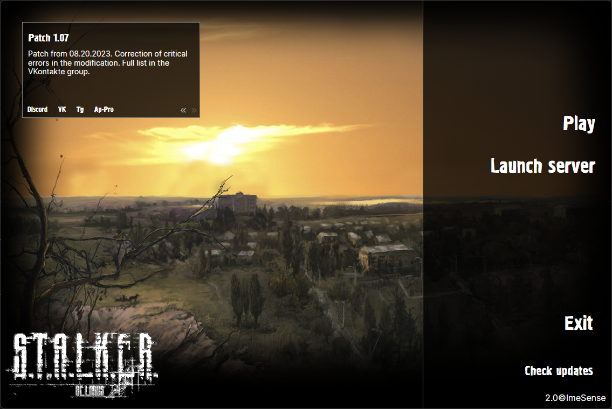

# Belarus Launcher

<div>
  <p>
    <a href="./LICENSE.md">
      
    </a>
    <a href="https://github.com/imesense/belarus-launcher/releases/tag/v2.1">
      
    </a>
    <a href="https://github.com/imesense/belarus-launcher/releases">
      
    </a>
    <br />
    <a href="https://github.com/imesense/belarus-launcher/actions/workflows/build-launcher.yml">
      
    </a>
    <a href="https://github.com/imesense/belarus-launcher/actions/workflows/build-legacy.yml">
      
    </a>
    <a href="https://github.com/imesense/belarus-launcher/actions/workflows/build-hasher.yml">
      
    </a>
  </p>
</div>

English | [Русский](./README.ru.md)

Specialized launcher for Belarus modification for downloading and updating modification, viewing current news and launching modification with server



## Features

- **Downloading** modification with updates: the launcher allows to download modification easily, quickly and automatically check for updates
- **Viewing** up-to-date news: the player will always be aware of the latest events, updates and announcements thanks to easy access to current news
- **Starting** the game with server in user-friendly interface

Launcher provides ease of use and easy access to the necessary functions so that the player can fully enjoy the gameplay

## Requirements

- Visual Studio 2022, Visual Studio Code or Rider
  - Avalonia plugin
- .NET 7 SDK
- Git
- Inno Setup

## Building

- Download the repository:

  ```console
  git clone https://github.com/imesense/belarus-launcher.git
  ```

- Build `BelarusLauncher.sln` using IDE or command:

  ```console
  dotnet build BelarusLauncher.sln
  ```

## Contributors

Everyone who involved in the development listed in [this](./CONTRIBUTORS.md) file

## License

Contents of this repository licensed under terms of the custom MIT-like noncommercial license unless otherwise specified. See [this](./LICENSE.md) file for details
