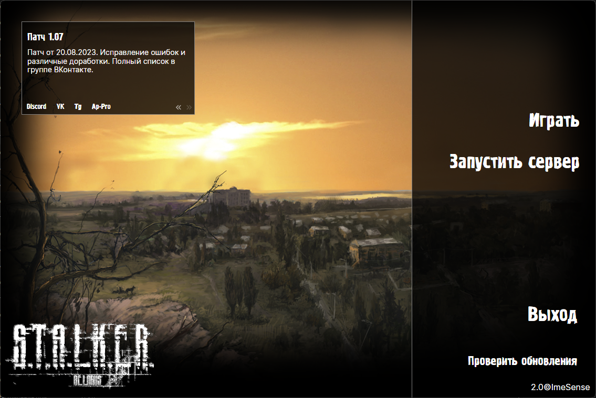

# Belarus Launcher

[](https://github.com/imesense/belarus-launcher/actions/workflows/build-launcher.yml)

[English](./README.md) | Русский

Специализированный лончер для модификации Беларусь для загрузки и обновления модификации, просмотра текущих новостей и запуска модификации с сервера



## Особенности

- **Загрузка** модификации с обновлениями: лончер позволяет легко, быстро загружать модификацию и автоматически проверять наличие обновлений
- **Просмотр** актуальных новостей: игрок всегда будет в курсе последних событий, обновлений и анонсов благодаря лёгкому доступу к текущим новостям
- **Запуск** игры с сервером в удобном интерфейсе

Лончер обеспечивает простоту использования и лёгкий доступ к необходимым функциям, чтобы игрок мог в полной мере насладиться игровым процессом

## Требования

- Visual Studio 2022, Visual Studio Code или Rider
  - Avalonia плагин
- .NET 7 SDK
- Git
- Inno Setup

## Сборка

- Скачать репозиторий:

  ```console
  git clone https://github.com/imesense/belarus-launcher.git
  ```

- Собрать `BelarusLauncher.sln` используя IDE или команду:

  ```console
  dotnet build BelarusLauncher.sln
  ```

## Участники

Все, кто были вовлечены в разработку, перечислены в [этом](./CONTRIBUTORS.ru.md) файле

## Лицензия

Содержимое этого репозитория лицензировано на условиях пользовательской некоммерческой MIT-подобной лицензии, если не указано иное. Подробности смотрите в [этом](./LICENSE.ru.md) файле
